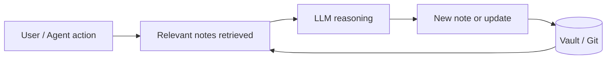

# LLM Wiki

> [!summary]
> A structured markdown knowledge base — wiki-linked, tagged, versioned — designed to be read and written by LLMs as well as humans. Pairs the durability of a personal wiki with the retrieval power of modern language models.

## Why a wiki for LLMs

LLM context windows are large but finite, and sessions are stateless by default. A wiki acts as **external memory**: a durable, queryable layer the model can retrieve from and write back into.

Key properties:

- **Portable.** Plain markdown, no vendor lock-in. Works in [[Obsidian]], Git, any editor.
- **Linkable.** `[[wiki-links]]` form a knowledge graph the LLM can traverse.
- **Tagged.** `#tags` give lightweight classification and filtering.
- **Diffable.** Git history = provenance, rollback, attribution.
- **Composable.** Notes are atomic units that can be recombined per query.

## Prior art and patterns

- [[Zettelkasten]] — atomic notes, permanent IDs, dense linking. The conceptual ancestor.
- [[PARA Method]] — Projects / Areas / Resources / Archives. Good for operational knowledge.
- [[Obsidian]] vaults — the de-facto format for LLM-friendly personal wikis.
- **LLM-native patterns** — RAG over markdown, MCP servers exposing vaults, agent-written daily notes.

## The "Claude Brain" idea

See [[Claude Brain]] for the full concept. In short: an [[Obsidian]]-compatible vault that doubles as a [[Second Brain]] for a team, with [[Claude]] as the primary read/write agent.

### Core loop



1. Every meaningful artifact (decision, research, incident, spec) becomes a note.
2. The LLM retrieves relevant notes before answering.
3. The LLM drafts new notes or updates existing ones after the work.
4. Humans review diffs; Git is the source of truth.

## Design principles

- **Atomic notes.** One concept per file. Title is the concept.
- **Link generously.** `[[double brackets]]` even for notes that don't exist yet — stubs surface gaps.
- **Tag sparingly.** Tags complement links; they don't replace them.
- **Write for the reader who has no context** — including future-LLM-you.
- **Prefer prose over bullet soup** when explaining *why*; bullets for *what*.
- **Date everything.** `created`, `updated`, and event dates in frontmatter.

## Folder shape (starting point)

```
/
├── README.md
├── LLM Wiki.md               ← this note (meta)
├── Claude Brain.md           ← the product idea
├── concepts/                 ← evergreen, definitional
├── projects/                 ← time-bounded work
├── decisions/                ← ADRs, one per decision
├── people/                   ← team members, stakeholders
└── daily/                    ← journal, optional
```

Keep it flat until it hurts. Folders are a last resort; links do the real work.

## Open questions

- [ ] What retrieval strategy — full-text, embeddings, graph-walk, or hybrid?
- [ ] Who owns note hygiene (merging duplicates, pruning stale stubs)?
- [ ] How do we handle sensitive content in a Git-backed vault?
- [ ] Conflict resolution when agents and humans edit the same note concurrently.

## References

- [Andy Matuschak — Evergreen notes](https://notes.andymatuschak.org/Evergreen_notes)
- [Obsidian docs](https://help.obsidian.md/)
- [Tiago Forte — *Building a Second Brain*](https://www.buildingasecondbrain.com/)
- [Niklas Luhmann on Zettelkasten](https://en.wikipedia.org/wiki/Zettelkasten)
